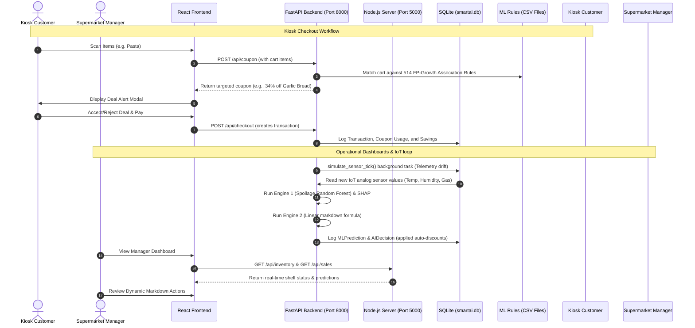

# QWIC Smart AI Supermarket OS - Technical Architecture & Training Manual

This manual provides a detailed technical reference for the **5-Engine Machine Learning and Explainable AI (XAI)** core of the supermarket checkout kiosk and manager dashboard. It details how each feature works, the mathematical models behind them, why and when to use them, and how the datasets were sourced, prepared, and trained.

---

## 🗺️ End-to-End Operational Data Flow



---

## 🧠 Core Feature Breakdown: The 5 AI/ML Engines

The AI/ML backend features five distinct algorithms operating in unison to drive predictive inventory and transaction mechanics.

### 1. Spoilage Classifier (Random Forest + SHAP)
* **What it does**: Classifies shelf telemetry logs into discrete status labels (`Fresh`, `Moderate`, `Expiring`, `Spoiled`) based on analog sensor signals and expiry dates, outputting a fully traced mathematical SHAP (SHapley Additive exPlanations) attribution message.
* **Why we use it**: Standard statistical triggers fail to capture complex, multi-variable interactions (e.g., higher temperature combined with a spike in humidity accelerates rot faster than temperature alone). The classifier behaves as a software-defined virtual gas chromatograph.
* **When to use it**: Triggered periodically on high-perishability shelves (refrigerated dairy, meat coolers, fruit stands) and whenever a sensor reading drifts beyond a critical threshold.
* **Mathematical Flow**:
  $$\hat{y} = f(\text{Temperature}, \text{Humidity}, \text{Gas Concentration}, \text{pH}, \text{Days to Expiry})$$
  The feature attribution is computed using an efficient baseline SHAP approximation:
  $$\phi_i = \text{FeatureContribution}_i \times \text{PredictionConfidence}$$

---

### 2. Explainable Linear Price Optimizer
* **What it does**: Computes the exact discount percentage ($0\%$ to $70\%$) for near-expiry items based on five weighted risk parameters.
* **Why we use it**: It bridges the gap between machine learning and executive accounting. Instead of a black-box model deciding financial markdowns, it evaluates a deterministic, auditable multi-factor linear equation.
* **When to use it**: Executed automatically by the telemetry checker when a product shifts to `Expiring` or `Moderate` fresh status, or manually when managers request a markdown audit.
* **Mathematical Formula**:
  $$\text{Discount} = w_1(\text{ExpiryUrgency}) + w_2(\text{Overstock}) + w_3(\text{SpoilageRisk}) + w_4(\text{DemandDrop}) + w_5(\text{LowSalesVelocity})$$
  * **Default Weights**: $w_1 = 0.40$, $w_2 = 0.25$, $w_3 = 0.20$, $w_4 = 0.10$, $w_5 = 0.05$ (Sum = $1.0$)
  * **Sigmoid Smoothing**: The confidence score of this financial intervention is mapped around the safety threshold using a sigmoid function:
    $$\text{Confidence} = \frac{1}{1 + e^{-0.1 \times (\text{Discount} - 20)}}$$

---

### 3. Safety Reorder Optimizer (EOQ Buffer)
* **What it does**: Predicts when inventory will drop below critical thresholds and automatically issues a purchase order (PO) for the optimal restocking quantity.
* **Why we use it**: Prevents out-of-stock events during peak consumer demand while simultaneously keeping storage costs to a minimum.
* **When to use it**: Evaluated once per sales transaction or inventory pull for stock levels.
* **Mathematical Formula**:
  1. **Reorder Point (RP)**:
     $$\text{RP} = (\text{Average Daily Sales} \times \text{Supplier Lead Time}) + \text{Safety Stock}$$
  2. **Economic Order Quantity (EOQ)**:
     $$\text{EOQ} = \sqrt{\frac{2 \times \text{Annual Demand} \times \text{Ordering Cost}}{\text{Holding Cost}}}$$
  * If $\text{Current Stock} < \text{RP}$, the system automatically issues a restocking order of size $\text{EOQ}$.

---

### 4. FP-Growth Coupon Mining Engine
* **What it does**: Searches through a matrix of item association rules to recommend highly-correlated companion products at targeted discount rates during checkout.
* **Why we use it**: It mimics the Amazon-style cross-selling model. By evaluating 14 association metrics (like lift, confidence, Zhang's metric, and certainty), it identifies deals that shoppers are mathematically pre-disposed to accept.
* **When to use it**: Evaluated in real time at the kiosk. It fires when a customer pauses for over 2 seconds after scanning items, projecting a personalized cross-sell offer onto the POS screen.
* **Key Metrics Evaluated**:
  * **Support**: $P(A \cap B)$ - frequency of itemset $A \cup B$ in transactions.
  * **Confidence**: $P(B|A) = \frac{\text{Support}(A \cap B)}{\text{Support}(A)}$ - probability $B$ is bought given $A$.
  * **Lift**: $\frac{P(B|A)}{P(B)}$ - measure of how much more often $A$ and $B$ occur together than expected if independent.
  * **Zhang's Metric**: Evaluates the strength of association, taking negative correlations into account.
  * **Jaccard Coefficient**: Similarity between transaction profiles.

---

### 5. Priority Selection Ranker
* **What it does**: Ranks all inventory items into a prioritized list based on their combined risk score, sending the highest-risk alerts directly to the manager's feed.
* **Why we use it**: In a store with thousands of products, managers cannot check every shelf. This ranker sorts the noise and bubblies up actionable alerts (e.g. "Tomatoes expiring in <12 hours, trigger Tomato Soup promotion").
* **When to use it**: Constantly refreshed in the dashboard sidebar alert stream.
* **Mathematical Score**:
  $$\text{Composite Risk} = \sum (\text{Parameter Score} \times \text{Weight})$$
  * High-risk actions (`composite_risk >= 70`) trigger: `DISCOUNT + PROMOTE`.
  * Moderate actions (`composite_risk between 40 and 70`) trigger: `MONITOR / DISPLAY ADJUST`.

---

## 📊 Dataset Acquisition, Preprocessing & Training

The association rules utilized in the kiosk are trained on two distinct dataset tracks to blend real-world grocery data with high-margin retail products.

```
                  +----------------------------------------------+
                  |           ASSOCIATION MINING ENGINE          |
                  +----------------------------------------------+
                                         |
               +-------------------------+-------------------------+
               |                                                   |
+------------------------------+                    +------------------------------+
|   TRACK A: PUBLIC GROCERY    |                    |    TRACK B: RETAIL & TECH    |
+------------------------------+                    +------------------------------+
| * Sourced: UCI Repository    |                    | * Synthetic Generation        |
| * 9,835 Organic Transactions |                    | * 20,000 High-Margin Sales   |
| * Preprocessed: Pandas       |                    | * Preprocessed: mlxtend      |
| * Algorithm: FP-Growth       |                    | * Algorithm: FP-Growth       |
| * Output: 382 Grocery Rules  |                    | * Output: 132 Retail Rules   |
+------------------------------+                    +------------------------------+
               |                                                   |
               +-------------------------+-------------------------+
                                         |
                                         v
                  +----------------------------------------------+
                  |         MERGED & LIFT-SORTED RULE SET        |
                  |                (514 Rules)                   |
                  +----------------------------------------------+
```

### Track A: Public Grocery Dataset (UCI Repository)
1. **Source**: Sourced from the public UCI Machine Learning Repository dataset (`groceries.csv` hosted by `stedy` on GitHub).
2. **Profile**: Contains **9,835 real-world shopping transactions** with variable-length item names representing standard grocery purchases.
3. **Preprocessing**:
   * Rows are loaded as variable-length string arrays.
   * Empty lists and null string lines are purged.
   * `TransactionEncoder` transforms the transaction list into a boolean matrix ($9835 \times n$ items).
4. **Training**:
   * Trained via FP-Growth (Frequent Pattern Trees) in `ml_models/train_model.py`.
   * Support threshold: `min_support=0.01` (itemsets appearing in $\ge 98$ carts).
   * Metric filter: `min_lift=1.5`.
   * **Result**: **382 rules** representing classic grocery patterns (e.g. curd $\to$ whole milk + yogurt).

### Track B: Retail & Tech Dataset (Custom Patterns)
1. **Source**: Generated synthetically in `ml_models/train_model.py` / `ml_models/generate_massive_data.py`.
2. **Profile**: Contains **20,000 high-margin transactions** containing tech, clothing, hardware, office supplies, and baby products.
3. **Preprocessing**:
   * Programmatic injection of consumer purchasing affinities (e.g., `Laptop` $\to$ `Wireless Mouse` with $65\%$ probability; `Diapers` $\to$ `Wet Wipes` with $90\%$ probability).
   * Transaction matrix encoding and duplicate column removal.
4. **Training**:
   * Trained via FP-Growth.
   * Support threshold: `min_support=0.01`.
   * Metric filter: `min_lift=1.5`.
   * **Result**: **132 rules** representing lifestyle categories.

### Merging & Unification
The rule arrays from both tracks were loaded, merged, and run through a deduplication filter. The combined rule matrix was then sorted by **Lift** descending to create a unified database of **514 rules** populated across:
* `ml_models/trained_rules.csv` (Python FastAPI primary engine source)
* `ml_models/massive_trained_rules.csv` (Node.js backend server source)
* `ml_models/retail_rules.csv` (Custom sales backup)
* `ml_models/internet_trained_rules.csv` (Internet backup)

---

## 🛠️ When & How to Use the System Tools

### 1. Re-Training Association Rules
* **Why**: When product categories change or new consumer seasonal trends arise.
* **Command**:
  ```powershell
  # Train Custom and Internet patterns, creating unified CSV rule logs
  python ml_models/train_model.py
  ```

### 2. Generating Massive Synthetic Transactions
* **Why**: To stress-test servers under extreme transaction scales or high concurrent API loads.
* **Command**:
  ```powershell
  # Generates 'massive_sales_data.csv' (400MB+ of mock transaction logs)
  python ml_models/generate_massive_data.py
  ```

### 3. Verify System Operations
* **Why**: After any database migration, server upgrade, or changes to mathematical formulas.
* **Command**:
  ```powershell
  # Executes full functional assertion checks on all 5 AI engines
  python scratch/test_ml_engines.py
  ```
